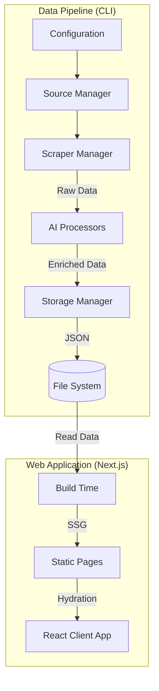

# AI Contests Navigator - System Architecture

This document provides a comprehensive overview of the system architecture, design patterns, and module interactions for the AI Contests Navigator project.

## 1. High-Level Architecture

The project follows a **"CLI Data Pipeline + Static Site Generation (SSG)"** architecture, decoupling data acquisition from data presentation.

## 2. Core Modules

### 2.1 Configuration Management
- **Location**: `src/config/`, `config/app.json`
- **Purpose**: Centralized management of platform settings, API keys, and system parameters.
- **Key Files**:
  - `app.json`: Defines platform selectors, URLs, and enabled states.
  - `config/index.ts`: TypeScript interface bindings and loading logic.

### 2.2 Scraper Layer
- **Location**: `src/scrapers/`
- **Pattern**: Factory Pattern (`ScraperManager`) with Strategy Pattern for individual scrapers.
- **Base Components**:
  - `BaseScraper`: Implements common logic like fetching, delay control, and basic logging.
  - `EnhancedScraper`: Extends `BaseScraper` with Puppeteer support for dynamic content (SPA).
- **Implementations**:
  - `ModelScopeScraper`: **API Mode**. Fetches data via REST API.
  - `DevpostScraper`: **Puppeteer Mode**. Handles client-side rendering.
  - `CivitaiScraper`: **Mixed Mode**. (Currently region-blocked).
  - `OpenArtScraper`: **Base/Puppeteer Mode**. (Verification in progress).

### 2.3 Data Processing (AI Enrichment)
- **Location**: `src/processors/`
- **Purpose**: Standardize and enrich raw contest data.
- **Key Features**:
  - **Deterministic ID Generation**: `MD5(platform + url)` ensures stable IDs for archiving and updates.
  - **AI Analysis**: Uses GitHub Models (GPT-4o/Jamba) to generate:
    - Summaries
    - Difficulty Assessments
    - Domain Tags
    - Standardized Status Mapping

### 2.4 Storage Layer
- **Location**: `src/storage/`
- **Purpose**: Persist data to the file system.
- **Structure**:
  - `data/raw/`: Raw scraped JSONs (for debugging and re-processing).
  - `data/processed/`: AI-enriched, validated JSONs (consumed by frontend).
  - `data/archive/`: (Planned) Storage for ended contests.

## 3. Web Application
- **Framework**: Next.js 14 (App Router)
- **Styling**: Tailwind CSS with "Deep Ocean" design system.
- **Features**:
  - **Hub**: Filterable grid/list view of contests.
  - **Detail**: Markdown-rendered contest details.
  - **Docs**: MDX-based documentation system.

## 4. Data Flow

1.  **Crawl**: `npm run crawl` triggers enabled scrapers defined in `app.json`.
2.  **Raw Save**: Scraped data is validated and saved to `data/raw`.
3.  **Process**: `AIProcessor` reads raw data, enriches it via LLM, and generating stable IDs.
4.  **Enriched Save**: Processed data is saved to `data/processed`.
5.  **Build**: Next.js reads `data/processed` at build time to generate static HTML.

## 5. Future Considerations
- **Archive System**: Automatically move old/ended contests to archive storage to maintain performance.
- **Automated Workflows**: GitHub Actions for scheduled scraping and deployment.
- **Proxy Management**: For region-restricted platforms (e.g., Civitai).
